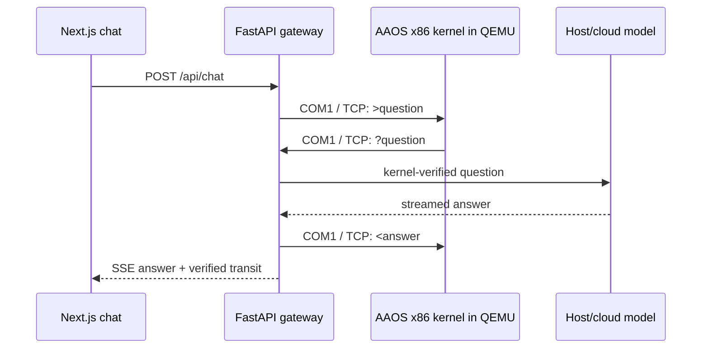
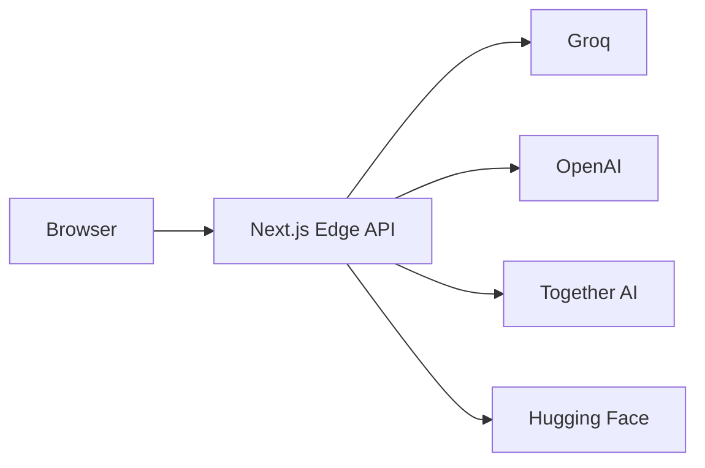

# AAOS Research

AAOS combines a [live multi-model AI research platform](https://aaos-research.vercel.app/)
with a custom 32-bit x86 Multiboot kernel written in C and Assembly.

**Stack:** Next.js, TypeScript, Node.js, FastAPI, Python, C, x86 Assembly, QEMU,
OpenAI-compatible APIs

> Built a custom 32-bit x86 Multiboot kernel in C and Assembly, connecting a
> Next.js/FastAPI AI chat platform through QEMU COM1 and a Python serial gateway
> that verifies every request/response round trip, with streaming multi-model inference.

## Kernel-backed web mode

The local full-stack demo literally sends each browser question through the running
kernel before inference. The answer is sent back through the kernel before FastAPI
finishes the browser stream.



The kernel owns the Multiboot entry point, VGA text output, COM1 UART driver, and
line protocol. Model inference runs on the host or cloud provider; the project does
not claim that an LLM runs inside the 32-bit kernel.

Start with the implementation:

- [`src/boot.s`](src/boot.s) - Multiboot header and x86 entry point
- [`src/kernel.c`](src/kernel.c) - VGA, COM1, and kernel chat loop
- [`api/kernel_link.py`](api/kernel_link.py) - verified Python serial gateway
- [`api/main.py`](api/main.py) - FastAPI SSE and model orchestration
- [`web/app/chat/page.tsx`](web/app/chat/page.tsx) - browser client

## Production web mode

The Vercel deployment uses the Next.js Edge API directly because a cloud function
cannot reach a QEMU process on a developer's laptop. It provides streaming model
fallbacks, web search, stock data, image input, PDF Q&A, and LaTeX rendering.



## Run the literal kernel connection

Prerequisites: LLVM, QEMU, Python 3.11+, and Node.js 20+.

```powershell
python -m pip install -r api/requirements.txt
Set-Location web
npm install
Set-Location ..
./build.ps1
```

Then use three terminals from the repository root.

```powershell
# Terminal 1: expose QEMU COM1 on 127.0.0.1:4555
./run.ps1 -Chat
```

```powershell
# Terminal 2: kernel-required FastAPI gateway
$env:OPENAI_API_KEY = "your-key"
# Or run the complete round trip offline: $env:AAOS_MOCK_LLM = "1"
python -m uvicorn api.main:app --reload --host 127.0.0.1 --port 8000
```

```powershell
# Terminal 3: point the browser at FastAPI instead of the Vercel-style route
Set-Location web
$env:NEXT_PUBLIC_API_BASE = "http://127.0.0.1:8000"
npm run dev
```

Open [http://localhost:3000/chat](http://localhost:3000/chat). A successful message
shows **x86 kernel transit verified** and appears on the QEMU VGA console. If QEMU or
the kernel handshake is unavailable, the API returns an error instead of silently
bypassing the kernel.

## Kernel protocol

| Frame | Direction | Meaning |
|---|---|---|
| `READY` | kernel to gateway | kernel finished booting |
| `>question` | gateway to kernel | submit browser question |
| `?question` | kernel to gateway | exact kernel echo required before inference |
| `<answer` | gateway to kernel | render final provider answer on VGA |

Questions and answers are converted to single-line ASCII because the freestanding
kernel intentionally uses a compact fixed-size serial buffer.

## Repository map

| Path | Role | Runs where |
|---|---|---|
| `web/` | Next.js frontend and production Edge API | Vercel or local |
| `api/` | Kernel-required FastAPI gateway | local host |
| `src/` | 32-bit x86 kernel | QEMU guest |
| `bridge/` | Standalone terminal serial demo | local host |
| `build.ps1`, `Makefile`, `linker.ld` | freestanding kernel build | local host |
| `run.ps1` | QEMU window, headless test, or TCP COM1 mode | local host |

## Verification

```powershell
./run.ps1 -Headless
Set-Location web
npm run lint
npm run build
```

## License

MIT
